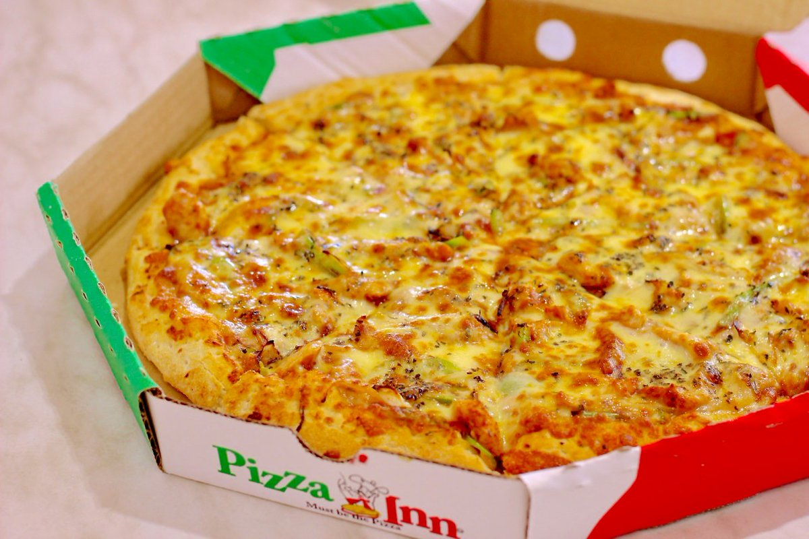

# Delanistudio
## screenshot


## Author

[Eid Abdullahi](https://github.com eidAbdullahi)

## Description

This project is a web application for pizza delivery that shows details about the services it offers, has information about the pizza delivery, a portfolio section and a form that enables users to send their messages and concern to Delivey option. 

## Live Page 

## Installation / Setup instruction
* Open Terminal {Ctrl+Alt+T}

* git clone (```https://github.com/EidAbdullahi/pizza.)

* cd pizza-

* code . or atom . depending on the text editor of your choise.

## Technologies Used

* [HTML5](https://github.com/topics/html5)
* [CSS](https://github.com/topics/css3)
* [Bootstrap](https://github.com/topics/bootstrap)
* [jQuery](https://github.com/topics/javascript)
* [javasript]
* markdown


## Known Bugs
* The site is not responsive enough for some devices. 
* mail chimp API does not function properly.

## Contact Information 

If you have any question or contributions, please email me at [eidabdullahi10@gmail.com]

## License

* Copyright (c) 2020 **EidAbdullahi**
